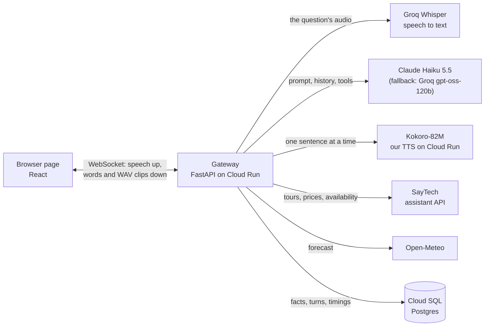

# Sarjy

Sarjy is a voice concierge for Magic Experience, a tour operator in Dubai. A traveller holds
the orb and talks; Sarjy finds real UAE activities with their real prices and live
availability, checks the weather, remembers what the traveller tells it across visits, and
answers out loud. The deep dive is **latency**: time to first audio is measured on every
turn, shown live in the page, and brought down through nine documented experiments.

**Try it:** <https://sarjy.magicexperience.ae>, in Chrome or Safari, on a laptop or a phone.
No login and nothing to install: allow the microphone, tap the microphone and speak, then
tap again to send (or switch to holding it in the settings). The page opens in voice mode:
Sarjy's orb takes turns with you, and its words light up as they are spoken; the ✕ opens the
full conversation, with what Sarjy remembers, your earlier visits and the latency
waterfall.

| | |
| --- | --- |
| Loom walkthrough | _added at submission_ |
| Short PDF | _added at submission_ |
| Latency deep dive | [`docs/LATENCY.md`](docs/LATENCY.md) |
| Cost per conversation | [`docs/COST.md`](docs/COST.md) |
| Every decision, with its reason | [`docs/DECISIONS.md`](docs/DECISIONS.md) |
| The plan and its progress | [`docs/PRD.md`](docs/PRD.md), [`docs/TASKS.md`](docs/TASKS.md) |

## What to ask it

The four scenarios from the plan, each working on the deployed URL:

1. **Find an activity.** "I'm in Abu Dhabi next week with two kids. What can we do under
   400 dirhams?" Sarjy searches the catalogue and names two or three real tours with their
   prices.
2. **Remember across sessions.** "My favourite colour is green, and I don't like heights."
   Close the tab, open it again: "What's my favourite colour?" → "Green". Later suggestions
   leave out the helicopter.
3. **Weather-aware advice.** "Is tomorrow afternoon good for a desert safari?" Sarjy checks
   the forecast and gives the real temperature, suggesting a cooler time when it's too hot.
4. **Honest when data is missing.** "How much is the buggy dune bashing tour?" → its price
   is on request, never an invented number.

Also worth trying: "Is the helicopter flight available next Saturday for two adults?"
(live availability with the price for the party), "What's the weather in Abu Dhabi on
Friday?", picking another voice, and the earlier visits above the conversation, whose
answers can be played again.

## Why these APIs

Sarjy calls **SayTech's assistant API** for tours, prices, policies and availability, and
**Open-Meteo** for the weather. Magic Experience is a real Dubai tour operator, run by my
brother, and its website runs on SayTech, my own multi-tenant platform, so the catalogue
Sarjy speaks from is the one customers book from:
real products, prices from the website's own checkout, and honest gaps such as "price on
request" or "can't check availability" (D-56, D-99). A tour concierge in the UAE lives or
dies on the heat, so the forecast turns "what can we do?" into "go at six, it's cooler",
and Open-Meteo needs no key and covers the next sixteen days (D-17, D-60).

## How it works



One turn, from the moment the traveller lets go of the orb:

1. The page has been streaming the question's audio while it was spoken; letting go sends
   `turn_end`.
2. The gateway sends the audio to Groq Whisper and, at the same time, builds the prompt: the
   rules and SayTech's catalogue context (cached by Claude, D-93), then the traveller's saved
   facts and the time.
3. Claude streams its answer. When it calls a tool (search, tour details, availability,
   weather, remember or forget a fact), the gateway runs it, tells the page what it is doing
   ("Checking tomorrow's weather in Dubai"), and asks Claude again with the result.
4. Each sentence goes to TTS as soon as it is complete (D-76), and its WAV clip goes to the
   page, which plays the clips back to back on the audio clock (D-77), showing each
   sentence's words as they are spoken.
5. The gateway stores the turn and its timing marks; the page adds its own and shows where
   the time went.

## Latency

Time to first audio (TTFA) runs from the end of the question to the first sound of the
answer, split into gaps by seven marks (`docs/LATENCY.md`). On the deployed service, over the
same ten spoken questions, 30 turns a run:

| | p50 | p95 |
| --- | --- | --- |
| Before the deep dive (experiment 1, 9 Oct) | 7.9 s | 10.7 s |
| Speaking each sentence as it is written (experiment 2, 9 Oct) | 3.4 s | 6.5 s |
| Final, on `sarjy.magicexperience.ae` (10 Oct) | 4.1 s | 6.4 s |

Synthesising the whole reply before playing any of it was half the wait; streaming it a
sentence at a time took TTS from 3.5 s to 0.8 s. The final run's median is higher because
the model opened with longer sentences that day, which makes the length of the first
sentence the next lever. Waking TTS when a visit opens hides a 6 s cold start, the model
choice favoured the one that calls its tools correctly over the one that answers fastest
without them, and prompt caching, the region and the tool payload size changed little or
nothing, each with the numbers to show it. `docs/LATENCY.md` has every experiment, where
the time goes now, what worked, what didn't, and what I'd do with another week.

## Cost

About **$0.027 (10 fils)** for a ten-question conversation: speech to text $0.001, Claude
$0.004, our own TTS $0.011 and the gateway at most $0.011. Self-hosted TTS costs a ninth of
ElevenLabs Flash per conversation, but keeping it warm costs $3.63 a day, which pays off
from about 44 conversations a day. Details in [`docs/COST.md`](docs/COST.md).

## Run it locally

With [Docker](https://www.docker.com/) and keys for Groq (speech to text) and Anthropic
(Claude):

```bash
cp .env.example .env    # then set SARJY_GROQ_API_KEY and SARJY_ANTHROPIC_API_KEY in it
docker compose up --build
```

Then open <http://localhost:8080>. Compose builds the same images as production: Postgres,
the TTS service (its first build downloads the 420 MB Kokoro model) and the gateway with the
page. To answer with Groq instead of Claude, set `SARJY_LLM_API_KEY` to the Groq key and
`SARJY_LLM_PRIMARY=groq`. The development commands (tests, the standards check, the frontend
dev server, the experiment scripts, Terraform) are listed in [`AGENTS.md`](AGENTS.md).

## Decisions and trade-offs

Each is recorded with its reason and the alternatives in [`docs/DECISIONS.md`](docs/DECISIONS.md).

- **Our own TTS.** Kokoro-82M on ONNX Runtime with our own text front end (D-38), on Cloud Run
  with 8 vCPU (D-70): full control of latency, a sentence at a time, and a fraction of a
  per-character price.
- **Sentences, not whole replies, not words** (D-76, D-77): the first sentence is spoken while
  the model writes the rest; words would be too short for natural speech.
- **Claude Haiku 5.5 first, Groq's gpt-oss-120b as the fallback** (D-69, D-96): Haiku was the
  only model that saved the facts said in passing; Qwen was faster only because it skipped
  its tools and invented a price.
- **Memory through tools** (D-15, D-67): the model saves a fact with `remember_fact`; facts go
  into every prompt and the "What Sarjy remembers" panel, and "Forget me" deletes them.
- **Grounded or silent.** Prices and availability come only from SayTech; "price on request"
  and "unknown availability" are said as such (D-71, D-99), and each turn keeps its tool
  results in the history so later turns trust earlier answers (D-100).
- **Warm instances for review week** (D-78): one gateway and one TTS instance stay warm, about
  $4 a day, and go back to zero afterwards, when waking TTS as a visit opens hides its cold
  start.
- **One region, Doha** (D-98): a US region would cut the hops to the AI providers by about
  0.3 to 0.45 s a turn, but Gulf visitors would pay part of it back, and moving everything a
  day before the submission wasn't worth it.
- **Cloud Run, Cloud SQL, Terraform, keyless CI** (D-22, D-46): deploys run on every merge to
  `main` through Workload Identity Federation; no long-lived keys exist. A global load
  balancer gives the gateway Magic Experience's own domain (D-101), since Cloud Run can't
  map one in Doha.
- **Known limit: a deploy drops the visits in progress** (D-102). The page reconnects, but a
  question asked at that moment is lost, so merges wait for quiet times.

## Tested devices

The four scenarios by voice on the deployed URL, 10 Oct:

| Device and browser | Result |
| --- | --- |
| MacBook, Chrome | pass |
| MacBook, Safari | pass |
| iPhone, Safari | pass |
| Android, Chrome | not tested (no device) |

## Repository

```text
gateway/     the voice gateway: FastAPI, the turn pipeline, tools, memory (sarjy_gateway)
tts/         the Kokoro TTS service and its text front end (sarjy_tts)
frontend/    the React page, built into the gateway's image
infra/       Terraform for Cloud Run, Cloud SQL, Artifact Registry, Secret Manager, CI access
scripts/     deploy.sh (CI) and hops.sh (experiment 7)
docs/        PRD, tasks, decisions, latency, cost, and the measured runs
```

## Standards and how it was built

The repository follows Sarj's public [code standards](https://code-standards.sarj.ai) and
[repository standards](https://repo-standards.sarj.ai) from the first commit: ruff,
basedpyright in strict mode, ESLint, React Doctor and their own checks run in a pre-commit
hook and in CI, and none is bypassed (D-26). Every external service sits behind a small interface
with one adapter, and the tests use fakes, never the network.

Sarjy was built with Claude Code. I wrote the plan (`docs/PRD.md`), split it into tasks
(`docs/TASKS.md`) and set the working rules (`AGENTS.md`): one task at a time, a plan
approved before any code, tests and the full standards check before every commit, nothing
pushed or deployed without my go, and every decision written down with its reason. Separate
Claude Code sessions worked in parallel on the backend and latency, the page, and SayTech's
new availability endpoint, each reporting to the others through the repository's docs. I
reviewed each change and can walk through every line of it.
