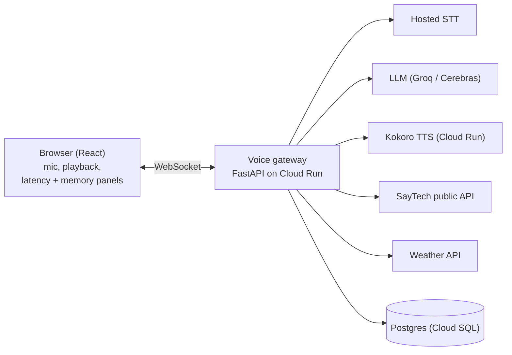

# Sarjy — PRD / TDD

Status: draft, 7 Oct 2026

## Summary

Sarjy is a voice concierge for Magic Experience, a Dubai-based tour operator: a traveller talks to it, and it finds real UAE activities, checks the weather, and remembers their preferences across visits.

It answers from live data, not guesses. Products, prices and FAQs come from the SayTech public API (my own multi-tenant platform, which powers the Magic Experience website); weather comes from a third-party API. The deep dive is **latency**: time-to-first-audio is measured on every turn, shown live in the UI, and driven down through documented experiments, including a self-hosted Kokoro TTS service.

Timeline: assignment received 7 Oct 2026, 5 PM; submission due by 11 Oct 2026, 5 PM, through Ashby.

## Goals and scope

The goal is a voice assistant a reviewer can open from one URL and enjoy in under a minute, with every brief requirement met and one area done in depth.

| Brief requirement | How Sarjy meets it |
| --- | --- |
| Listens and responds by voice | Browser mic → hosted STT → streaming LLM → self-hosted Kokoro TTS, over one WebSocket |
| Remembers across sessions | Anonymous user id in a cookie; facts saved by the LLM through a `remember_fact` tool into Postgres; shown in a "What Sarjy remembers" panel |
| Calls at least one external API | SayTech public API (tours, prices, FAQs) and a third-party weather API, both as LLM tools |
| Deployed, no special setup | Public HTTPS URL on GCP Cloud Run; no login, no install |
| Deep dive | Latency: measured per stage, shown live, documented in `LATENCY.md` |
| Presentation | Loom walkthrough + short PDF sent before the meeting |

**Goals**

- It works the first time, on a laptop and a phone, in Chrome and Safari.
- The traveller can pick Sarjy's voice from a short list; `af_heart` is the default, and the choice is remembered.
- Prices and availability always come from tool results, never from the model's memory.
- Time-to-first-audio is measured on every turn and visibly improved by each experiment.
- Every line in the repo is code I can explain.

**Non-goals**

- Booking or payment. Sarjy recommends and links to the product page; it never takes money.
- Accounts and login. Identity is an anonymous cookie, so the reviewer needs no setup.
- Arabic voice output. Kokoro has no Arabic voice as far as I know; this goes in "what I'd do next".
- Telephony, multiplayer, avatars.

## Demo scenarios

These four conversations are the acceptance tests: each must work end to end on the deployed URL before submission.

1. **Find an activity.** "I'm in Abu Dhabi next week with two kids. What can we do under 400 dirhams?" → Sarjy searches SayTech, answers with two or three real products and their real prices.
2. **Remember across sessions.** "My favourite colour is green, and I don't like heights." Close the tab, open it again: "What's my favourite colour?" → "Green." Asking for activities later skips the helicopter flight.
3. **Weather-aware advice.** "Is tomorrow afternoon good for a desert safari?" → Sarjy checks the forecast and answers with the actual temperature, suggesting a time if it's too hot.
4. **Honest when data is missing.** "How much is the buggy dune bashing tour?" (no price in SayTech) → "Price is on request", never an invented number.

Each scenario also shows its latency waterfall in the UI, so the deep dive is visible during the demo itself.

## Deep dive: latency

The metric is **time-to-first-audio (TTFA)**: from the moment the user stops speaking to the moment Sarjy's first audio sample plays in the browser. It is what a caller actually feels.

**How it is measured.** Every turn gets a `turn_id`, and each stage records a timestamp. The browser reports the two ends (speech end, playback start); the gateway records everything between. One turn's timeline:

| Mark | Recorded by |
| --- | --- |
| `speech_end` | browser |
| `audio_received` | gateway |
| `stt_done` | gateway |
| `llm_first_token` | gateway |
| `first_sentence_ready` | gateway |
| `tts_first_byte` | gateway |
| `playback_start` | browser |

Browser and server clocks differ, so browser-side gaps are measured with the browser's clock only, and server gaps with the server's. Results are stored per turn and summarised as p50 and p95 over a fixed script of test questions, so experiments compare like with like.

**Experiments**, each run against the same script and recorded in `LATENCY.md` with before/after numbers:

1. **Baseline:** wait for the full LLM reply, then synthesise all of it.
2. **Sentence streaming:** send the first sentence to TTS while the LLM is still writing.
3. **TTS cache:** content-addressed cache for repeated phrases (greetings, confirmations).
4. **Model choice:** compare LLM providers and sizes on first-token time (Groq, Cerebras, Gemini).
5. **Tool payload size:** a lean SayTech tool result vs the raw API response, measured in tokens and time.
6. **Warm vs cold:** Cloud Run minimum instances on vs off.
7. **Region:** the cost of the network hop from the Gulf to the providers.
8. **Stretch:** Kokoro on GPU vs CPU, if GPU quota is granted.

Targets are deliberately not promised here; the baseline sets them on day 2.

## Architecture

A single FastAPI gateway owns each turn: it receives the user's audio over one WebSocket, calls the services in order, and streams Sarjy's voice back sentence by sentence.

The gateway is the only component that talks to providers, so keys stay server-side and every stage can be timed in one place.

| Layer | Choice | Reason |
| --- | --- | --- |
| Frontend | React + Vite + TypeScript, served by the gateway | React is my strongest frontend; TypeScript matches Sarj's stack |
| Transport | One WebSocket per session | Streams audio both ways with little overhead |
| Turn-taking | Push-to-talk first, voice activity detection next | A reliable demo first; barge-in is on the cut list |
| STT | Hosted Whisper-class model, e.g. on Groq (confirm day 1) | Fast, and on Sarj's list of preferred providers |
| LLM | Groq or Cerebras, streaming with tool calls | Fast first token; final pick decided by measurement |
| TTS | Kokoro-82M as my own service, with a few selectable voices | Full control over latency and caching |
| Backend | Python, FastAPI, Pydantic, asyncio | My strongest stack; async fits streaming |

## Memory and data model

Memory is explicit: the LLM decides what is worth keeping and calls a tool to save it, and saved facts are loaded into the system prompt at the start of every session.

**Identity.** On first visit the server issues a random `user_id` in an HTTP-only cookie. No login, so the reviewer needs nothing; clearing cookies starts a fresh user. A "Forget me" button deletes the user's facts.

**What gets saved.** Stable facts and preferences only ("favourite colour: green", "travelling with two children", "avoids heights"), not every sentence. Each fact has a short key, so saying "actually my favourite colour is blue" updates the same fact instead of adding a second one.

**Tables (Postgres):**

| Table | Columns | Purpose |
| --- | --- | --- |
| `users` | `id`, `created_at`, `last_seen_at` | One row per cookie |
| `facts` | `user_id`, `key`, `value`, `updated_at`; unique (`user_id`, `key`) | Long-term memory; upsert with `ON CONFLICT` |
| `sessions` | `id`, `user_id`, `started_at` | One per page visit |
| `turns` | `id`, `session_id`, `role`, `text`, `created_at` | Conversation history |
| `turn_timings` | `turn_id`, `mark`, `at_ms` | Latency marks for the deep dive |

Recent turns of the current session go to the LLM as context; older sessions are not replayed, only their facts. This keeps prompts short, which also keeps latency down.

## Tools

The LLM gets five tools; each returns small, typed results so the model reads fewer tokens and cannot invent fields.

| Tool | Input | Returns |
| --- | --- | --- |
| `search_tours` | city, max price (AED), category, accessible | Up to 5 products: name, price or "on request", city, link |
| `get_tour` | product slug | One product's details and the matching FAQ answers |
| `get_weather` | city, date | Temperature and conditions for that day |
| `remember_fact` | key, value | Confirmation |
| `forget_fact` | key | Confirmation |

**SayTech adapter.** Sarjy calls SayTech's existing public API and cleans the data in one place, with tests:

- Missing price (`"from": null`) becomes "price on request", never zero.
- Slugs containing spaces are URL-encoded before any request.
- Destination comes from the data as it is; known inconsistencies are noted, not silently "fixed".
- Responses are cached for a few minutes, and a last-known-good copy keeps the demo working if SayTech is unreachable.

First task on day 1: list which public SayTech endpoints exist (product list, detail, filters). A new SayTech endpoint is built only if search is impossible without it, and time-boxed to a few hours.

**Why these APIs.** A traveller's real questions are "what can I do" and "is it a good day for it". SayTech answers the first with a real operator's live catalogue, which I built and run; the weather API answers the second, since UAE heat decides whether a desert safari is fun or miserable. Together they make answers useful and checkable, not generic.

## Guardrails, abuse protection and cost

Guardrails here are light and practical, since the deep dive is latency; the aim is a public demo that stays honest, on-topic and within budget.

**Conversation**

- Scope: UAE travel, Magic Experience products, weather, and the user's own preferences. Off-topic requests get a short, friendly redirect.
- Prices, availability and forecasts come only from tool results. If a tool fails or returns nothing, Sarjy says so.
- No booking or payment: Sarjy shares the product link instead.

**Public URL protection**

- Rate limit per user and per IP on new turns.
- Maximum audio length per turn and maximum turns per session.
- Provider keys live in Secret Manager, never in the browser or the repo.
- GCP budget alert on the project; provider dashboards checked daily.

**Cost.** The README includes a small cost-per-conversation estimate (STT, LLM, TTS compute, hosting), filled with measured numbers once the baseline runs. Self-hosted TTS is part of that story: compute cost instead of a per-character bill.

## Infrastructure and deployment

Everything runs on GCP Cloud Run, defined in a small Terraform module and deployed by GitHub Actions; DNS stays in DigitalOcean, with a DigitalOcean droplet as the fallback if GCP blocks day 1.

| Resource | Choice | Why |
| --- | --- | --- |
| Gateway + web app | Cloud Run service, serves the built frontend and the WebSocket | One origin: no CORS, simple HTTPS mic access |
| TTS | Separate Cloud Run service running Kokoro | Scales and is measured on its own |
| Database | Cloud SQL for PostgreSQL, smallest tier | Matches Sarj's stack; `ON CONFLICT` upserts |
| Images | Artifact Registry | Built by CI |
| Secrets | Secret Manager | Provider keys never in code |
| CI/CD | GitHub Actions with Workload Identity Federation | No long-lived service-account keys |
| Domain | `sarjy.saytech.ae` via a DNS record in DigitalOcean | The `*.run.app` URL works from day 1; custom domain is a nice-to-have |

Deploy happens on **day 1**, even if the app only says hello: HTTPS, WebSockets and mic permissions are the biggest hidden risks. A budget alert sits on the project from the first resource. Region is chosen after checking Cloud Run feature support, and the region itself becomes a latency experiment.

## Code quality and testing

The repo is written from scratch, aligned with Sarj's public code standards, and every commit tells part of the plan in this document.

- **Tooling:** uv, ruff, strict type checking, Conventional Commits, small focused commits. Sarj's public `code-standards` and `repo-standards` are adopted in the first milestone and enforced on every commit; any approved exception is listed in `docs/DECISIONS.md` with a reason. Credit to their repos is given openly.
- **Structure:** each external service (STT, LLM, TTS, SayTech, weather, database) sits behind a small interface with one adapter, so tests use fakes instead of real network calls.
- **Tests focus on the logic that can break:** the SayTech adapter's data cleaning, the sentence chunker, fact upserts, the latency timeline, tool argument validation, and rate limiting.
- **AI use:** allowed by the brief and used openly; an `AGENTS.md` documents the conventions. The rule I hold myself to: nothing is merged that I can't explain line by line.
- **README:** one-command local run, architecture diagram, decisions and trade-offs, API justification, cost estimate, and links to `LATENCY.md`.

## Milestones

The voice loop is deployed on day one, so every later day builds on a working URL; Sunday is reserved for docs and the submission.

| Dates | Work |
| --- | --- |
| Oct 7 to Oct 8 | PRD/TDD, first update to Sarj |
| Oct 8 | Voice loop deployed |
| Oct 9 | Memory, tools, tests |
| Oct 9 to Oct 10 | Latency experiments |
| Oct 9 to Oct 10 | UI polish, Safari and phone tests |
| Oct 10 to Oct 11 | README, LATENCY.md, Loom, PDF |
| Oct 11, by 5 PM | Submit |

Each day ends with a short update to Sarj. If a day slips, the cut list applies first: barge-in, then the custom domain, then the GPU experiment.

## Risks, open questions and updates

The biggest risk is scope: four calendar days for something that could absorb four weeks, so every hour must show up in the demo, the latency numbers or the presentation.

| Risk | Fallback |
| --- | --- |
| GCP setup or quota blocks day 1 | Deploy the same containers to a DigitalOcean droplet |
| Kokoro on CPU is too slow | Keep it as a measured experiment; use a hosted TTS for the live demo |
| SayTech API down during review | Cached last-known-good data inside Sarjy |
| Safari mic or audio playback quirks | Test Safari on day 2, not day 4 |
| Free-tier rate limits during review | Rate limiting on our side; ask Sarj for keys early, as their FAQ offers |
| Scope creep | Cut list decided in advance: barge-in and custom domain go first |

**Open questions to check on day 1**

- [ ] Which SayTech public endpoints exist for listing, details and filtering?
- [ ] Which provider gives the fastest hosted STT, and does it support streaming?
- [ ] Which Kokoro voices and languages are available?
- [ ] Which Cloud Run region supports what we need (WebSockets, domain mapping)?
- [ ] Turn-taking: push-to-talk first, or voice activity detection from the start?

**Updates to Sarj:** a short message every day, even on a quiet day. Day 1 opens with this PRD/TDD; the final update carries the demo URL, repo and Loom.
